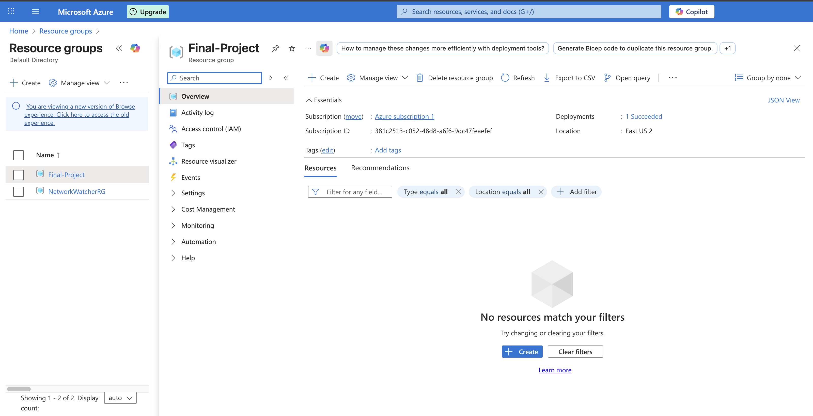
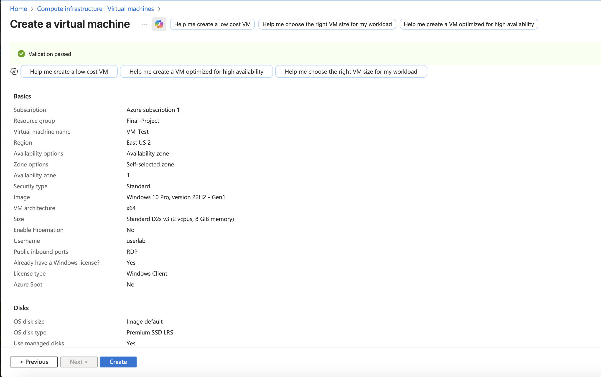
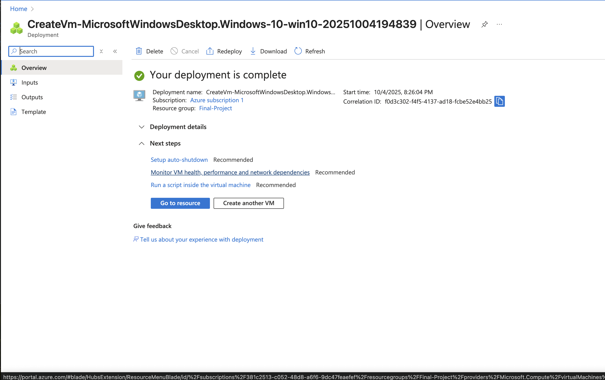
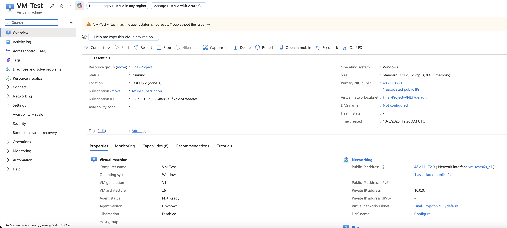
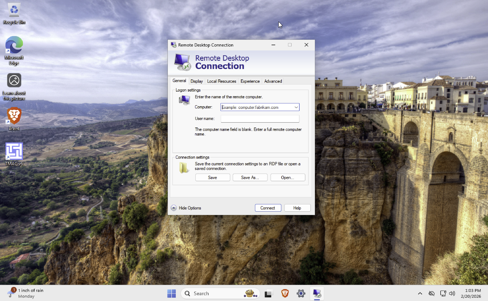
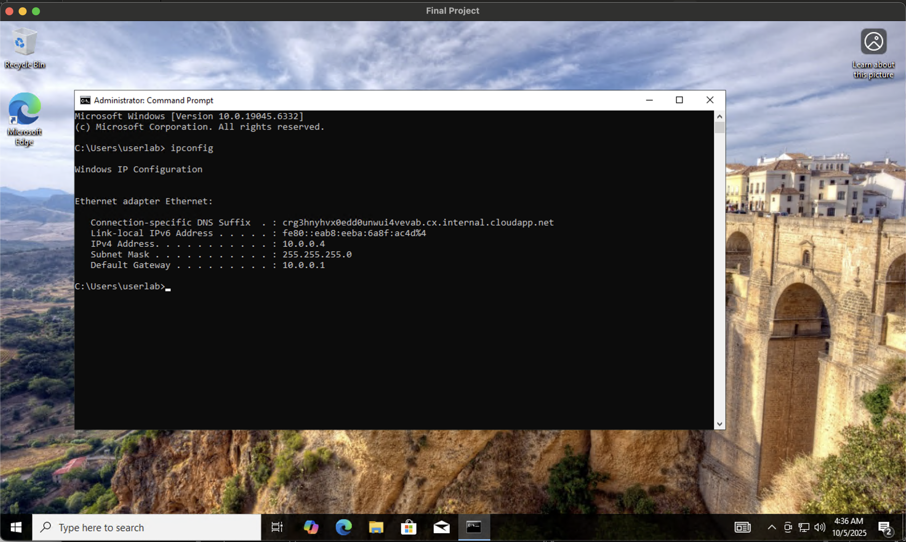

# Azure Virtual Machine Deployment and Network Connectivity Test

## 📌 Project Overview

This project demonstrates the deployment of a **Windows 10 Virtual Machine (VM)** in Microsoft Azure and validates its connectivity using Remote Desktop Protocol (RDP) and basic network diagnostic commands.

The objective of this hands-on lab is to showcase foundational cloud engineering skills, including cloud infrastructure deployment, secure remote access configuration, and system connectivity troubleshooting.

This project reflects practical knowledge relevant to entry-level roles in IT Support, Cloud Engineering, and DevOps.

---

## 🛠 Technologies & Tools Used

- Microsoft Azure
- Windows 10 Virtual Machine
- Remote Desktop Protocol (RDP)
- PowerShell / Command Prompt

---

## 🌍 Environment

- Azure Cloud Platform
- Windows 10 Virtual Machine

---

## 🎯 Skills Demonstrated

- Azure Resource Group creation and management
- Virtual Network configuration
- Virtual Machine deployment and validation
- Public IP configuration
- Remote Desktop setup
- Network troubleshooting using `ipconfig`
- Connectivity validation using `ping`
- Basic cloud infrastructure documentation

---

# 🚀 Deployment Steps

---

## 1️⃣ Resource Group Creation

A Resource Group was created in the Azure Portal to logically organize all cloud resources.

**Purpose:**  
Provides centralized management and lifecycle control of Azure services.

📸 Screenshot:  


---

## 2️⃣ Virtual Network Creation

A Virtual Network (VNet) was configured with an address space and subnet.

**Purpose:**  
Enables secure communication between Azure resources.

📸 Screenshot:  


---

## 3️⃣ Virtual Machine Validation

Before deployment, the VM configuration was validated to confirm:

- Selected region
- Windows 10 image
- VM size
- Administrator credentials

Validation passed successfully.

📸 Screenshot:  


---

## 4️⃣ Virtual Machine Deployment

The Windows 10 Virtual Machine was successfully deployed in Azure.

Deployment confirmation showed all selected configurations applied correctly.

📸 Screenshot:  


---

## 5️⃣ VM Overview and Public IP Assignment

After deployment, the VM overview page was reviewed to confirm:

- VM status (Running)
- Assigned Public IP address
- Network configuration details

The Public IP address is required for Remote Desktop access.

📸 Screenshot:  


---

# 🔐 Remote Desktop Configuration

---

## 6️⃣ RDP Setup

Remote Desktop Protocol (RDP) was configured using the assigned Public IP address.

Security prompts were reviewed before establishing the connection.

📸 Screenshot:  


---

## 7️⃣ Successful RDP Connection

A successful Remote Desktop session was established with the Windows 10 Virtual Machine.

This confirms proper external connectivity and network configuration.

📸 Screenshot:  


---

# 🌐 Network Connectivity Testing

After logging into the VM, network diagnostic commands were executed to validate system functionality.

---

## 8️⃣ IP Configuration Test

Command executed:

```powershell
ipconfig
```

**Purpose:**  
Displays network adapter details including:

- IPv4 address
- Subnet mask
- Default gateway

This confirms proper internal network configuration.

📸 Screenshot:  


---

## 9️⃣ External Connectivity Test (Ping)

Command executed:

```powershell
ping 8.8.8.8 -n 4
```

**Purpose:**  
Tests outbound internet connectivity using ICMP echo requests to Google DNS (8.8.8.8).

Result:  
Four successful replies confirmed external network access.

📸 Screenshot:  


---

# 📊 Project Outcome

The successful deployment and connectivity validation confirm:

- Proper Azure infrastructure configuration
- Secure remote access functionality
- Working internal and external network communication
- Basic cloud troubleshooting capability

---

# 📚 Key Takeaways

- Understanding Azure resource organization
- Importance of Virtual Network configuration
- Role of Public IP in remote access
- Practical use of network diagnostic tools
- Foundational cloud engineering workflow

---

# 📌 Future Improvements

- Implement Network Security Group (NSG) rule customization
- Deploy additional VMs within the same VNet
- Test internal VM-to-VM communication
- Explore Azure monitoring and logging features

---

# 🏁 Conclusion

This project demonstrates foundational cloud infrastructure deployment and network validation skills using Microsoft Azure.

It reflects practical hands-on experience in configuring virtual machines, enabling secure remote access, and performing essential network troubleshooting key competencies for entry-level Cloud and IT roles.

---

## 👤 Author

**Gokah William**

Cloud & IT Professional  
Focused on Cloud Infrastructure, Troubleshooting, and DevOps Foundations.

---
